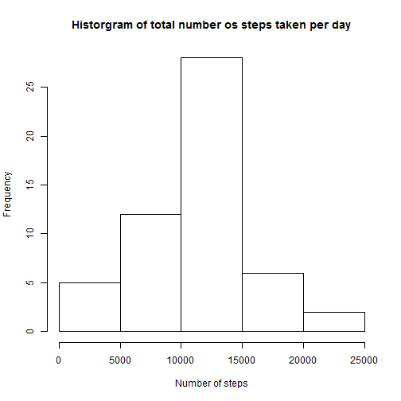
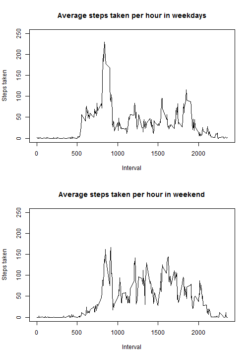

Coursera course: Reproducible Research (Student: SpurDK)

It is now possible to collect a large amount of data about personal movement using activity monitoring devices such as a [Fitbit](www.fitbit.com) or [Microsoft Band](https://www.microsoft.com/microsoft-band/en-us). These type of devices are part of the “quantified self” movement – a group of enthusiasts who take measurements about themselves regularly to improve their health, to find patterns in their behavior, or because they are tech geeks. But these data remain under-utilized both because the raw data are hard to obtain and there is a lack of statistical methods and software for processing and interpreting the data.

This report makes use of data from a personal activity monitoring device. This device collects data at 5 minute intervals through out the day. The data consists of two months of data from an anonymous individual collected during the months of October and November, 2012 and include the number of steps taken in 5 minute intervals each day.

The report will include both the nessesary code to reprdoce the findings in the data and also textual interpretation of the result found in the data. All analysis in this report is made using the statistical program [R](https://www.r-project.org/)

## Setup environment
This section of code shows the initial configurations of the script. Here we load in the nessesary CRAN
libraries, sets the seed to ensure reproduciblity and sets the working directory.


```r
setwd("C://Courses//Reproducible Research//Assignment One//RepData_PeerAssessment1")
set.seed(2016)
library(data.table)
library(dplyr)
```


## Loading and preprocessing the data
The data for this report is downloaded from [Roger D. Peng's GitHub](https://github.com/rdpeng/RepData_PeerAssessment1)
The variables included in this dataset are:

- steps: Number of steps taking in a 5-minute interval (missing values are coded as NA)
- date: The date on which the measurement was taken in YYYY-MM-DD format
- interval: Identifier for the 5-minute interval in which measurement was taken

The dataset is stored in a comma-separated-value (CSV) file and there are a total of 17,568 observations in this dataset. The dataset is loaded into memory using data.tables with the command below


```r
activityData <- fread('./data/activity.csv')
```

The data is tidy, with the one exception that the variable steps conatins NA-values. This values will be cleaned further on in the analysis.

## What is mean total number of steps taken per day?
In this section we will look into the number of steps taken each day. The code below will summarize the the dataset into date and the total number of steps taken. 


```r
stepsPerDay <- activityData %>%
                  group_by(date) %>%
                  summarise(total = sum(steps)) %>%
                  arrange(total)

hist(stepsPerDay$total, xlab="Number of steps", main="Historgram of total number os steps taken per day")
```

 

Based on a total of 61 days a nicely formed normal distrubtion of steps taken each days shows up - telling us that most days has a total number of steps taken between 10,000 and 15,000. To get further information, we can calculate the mean and median:


```r
round(mean(stepsPerDay$total, na.rm = TRUE) ,0)
```

```
## [1] 10766
```

```r
round(median(stepsPerDay$total, na.rm = TRUE) ,0)
```

```
## [1] 10765
```

The mean and median is very close to each other, indicating that the dataset dosen't have days with extreme low or high values. 

## What is the average daily activity pattern?
In this section we we look at the typical activity pattern for the subject of the dataset. To do this we sum all the steps for each interval and gets the mean. This shows a pattern which tells us a lot about the daily pattern of the subject. It is clear to see that most days starts around 6 am in the morning. Then a period of low activity is identified between 9 am and 3 pm, indicating that this person has a "sitting-job" like on an office. The evening has medium activity registred and the days ends around 10 pm in the evening.


```r
stepsAllDays <- activityData %>%
                  group_by(interval) %>%
                  summarise(avg = mean(steps, na.rm = TRUE))

plot(stepsAllDays, type="l", ylab="Average steps taken")
title("Average daily activity pattern")
```

 

On the line chart above it is clear to see, that the activity peak is in the morning. To identify the excact time we use the code below: 


```r
mostSteps <- stepsAllDays[, .SD[which.max(avg)]]
print(paste('Interval:', mostSteps$interval, 'Average step count:', round(mostSteps$avg, 0)))
```

```
## [1] "Interval: 835 Average step count: 206"
```

## Imputing missing values
As stated earlier in this report, the dataset contains missing values in the variable 'steps'. The excact amount is specified below: (TRUE indicating row count with NA's)


```r
table(is.na(activityData$steps))
```

```
## 
## FALSE  TRUE 
## 15264  2304
```

To clean the data into a fully tidy format all NA-values are substituted with the mean of the same interval for other days. To do this the code below is needed:


```r
activityDataCleaned <- activityData %>% 
                          group_by(interval) %>% 
                          mutate(steps = ifelse(is.na(steps), as.integer(mean(steps, na.rm=TRUE)), steps))
```

Now we re-run the analysis around the mean of total steps taken each day. The results are almost identical, just with a mean and median a little lower.  


```r
stepsPerDay <- activityDataCleaned %>%
                  group_by(date) %>%
                  summarise(total = sum(steps)) %>%
                  arrange(total)

hist(stepsPerDay$total, xlab="Number of steps", main="Historgram of total number os steps taken per day")
```

 

```r
round(mean(stepsPerDay$total, na.rm = TRUE), 0)
```

```
## [1] 10750
```

```r
round(median(stepsPerDay$total, na.rm = TRUE), 0)
```

```
## [1] 10641
```


## Are there differences in activity patterns between weekdays and weekends?
In the last section of this report, we will look into if there are any differences in the activity pattern between weekends and weekdays. To do this, we will split the dataset into two containing the two categories (weekeday and weekends). To compare the time series two line charts are plotted with the same axis-ranges.


```r
# Remember that sunday is first day of week
activityDataCleaned <- activityDataCleaned[, daycategory := 'Weekday'][wday(as.POSIXct(date)) %in% c(7,1), daycategory:= 'Weekend']

activityDataCleaned$daycategory <- as.factor(activityDataCleaned$daycategory)

stepsWeekdays <- activityDataCleaned[daycategory == 'Weekday'] %>%
                  group_by(interval) %>%
                  summarise(avg = mean(steps, na.rm = TRUE))

stepsWeekend  <- activityDataCleaned[daycategory == 'Weekend'] %>%
                  group_by(interval) %>%
                  summarise(avg = mean(steps, na.rm = TRUE))

par(mfrow=c(2,1))
plot(stepsWeekdays, type="l", xlab="Interval", ylab="Steps taken", ylim=c(0, 250))
title("Average steps taken per hour in weekdays")
plot(stepsWeekend, type="l",  xlab="Interval", ylab="Steps taken", ylim=c(0, 250))
title("Average steps taken per hour in weekend")
```

 

This indicates a clear difference in activity patterns between weekdays and weekends. Weekends starts off later around 8 am and the activity level through out the days is more equal distributed than in weekdays. The peak in the morning (8.35 am) isn't present in the weekend either. The days end almost at the same time around 10 pm.

This report has shown, that a lot can be said about a persons activity level from the number of steps taken.
